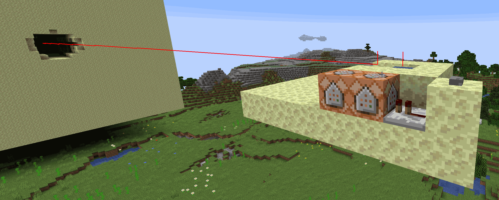
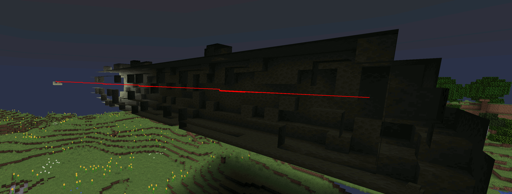
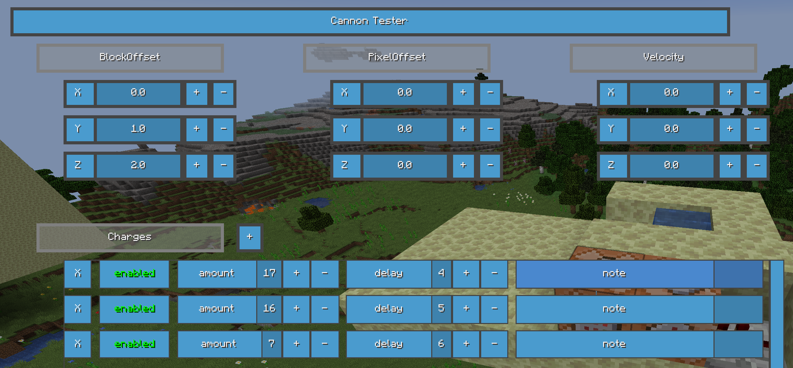
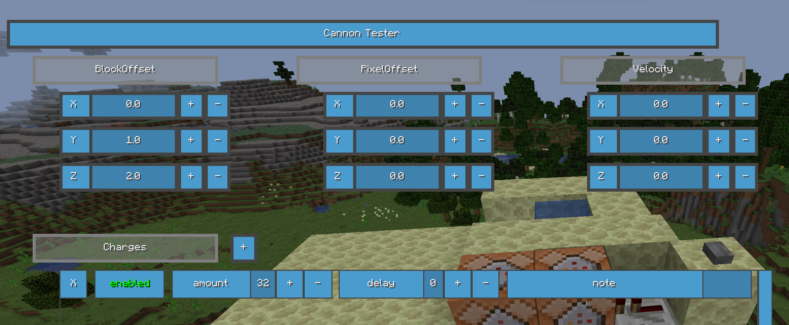
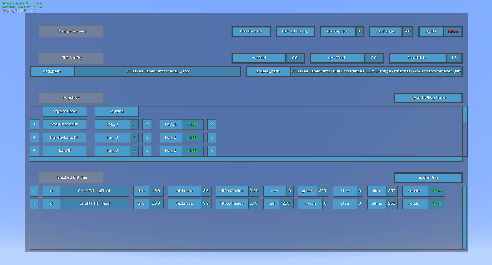
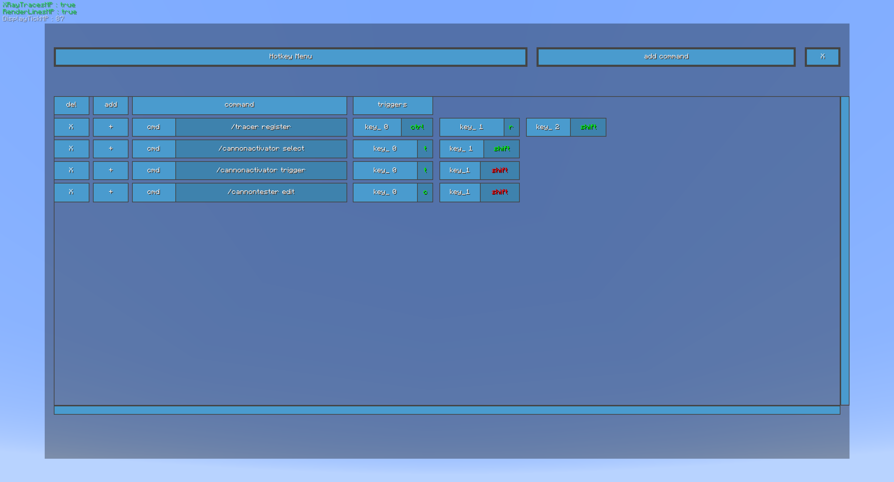

# CannonTracer

A Minecraft [Forge](https://files.minecraftforge.net/net/minecraftforge/forge/index_1.15.2.html) mod for debugging Cannons.  
Built for version 1.15.2

 

## Installation

* Get the [latest release](https://github.com/BlazingTwist/CannonTracer/releases/latest) of the mod and place it in your 'mods' folder.  
* Get the [latest release](https://github.com/BlazingTwist/JumperUtils/releases/latest) of the server plugin and install it on your server.  
    Alternatively, the mod supports tracing in single-player, but I heavily recommend the server version.
* If you're starting the mod for the first time, open the config window with `shift + c` and set the `cfg_path` option to where you want the config file to be saved.  
    For example: `C:\Games\Minecraft\tracer.json`.

 

## Usage

When you connect to a server with the tracer plugin, you have access to these commands:

|Command|Description|
|:---|:---|
|`/tracer register`|Tells the server that you have the mod and want to use it. This is necessary for the server to know that it should send tracer data to you.|
|`/cannonactivator select`|Select a Button/Lever/Block to activate Redstone from afar. If you select a block, it will be block-updated (useful for triggering observers).|
|`/cannonactivator trigger`|Press the selected Button / Flick the selected Lever / Update the selected Block.|
|`/cannontester edit`|When looking at a command-block, this command opens a simple GUI for spawning TNT.|

The mod also gives you these Key-Binds (drag the blue bar on the right to scroll):

|Key-Bind|Description|
|:---|:---|
|XRayTraces|Enable or Disable X-Ray for Entity Traces.|
|RenderLines|Enable or Disable the tracer lines, showing only the entity-boxes.|
|Menu|Open or Close the config menu.|
|PullData|Load tracer data from the server.|
|ClearData|Unload all tracer data.|
|DisplayTick (+/-)|Show the entity-boxes for the next/previous tick.|
|Display(Next/Prev)DespawnTick|Skip until the next/previous tick where an entity despawned (e.g. TNT exploded).|
|Show(First/Last)Tick|Skip to the first/last tick on which entities were traced.|

 

## Examples and Screenshots

#### CannonTracer and CannonTester in action

 

#### Configuration Screen

 

#### Hotkey Screen and recommended Hotkeys

 

## FaQ

#### Tracing more types of entities

In the GUI, enable `logIDs` to receive messages on spawning entities.  
Then press `add entity` and specify the `id` (name you received in chat).

|Option|Description|
|:---|:---|
|time|Length of the time interval to receive from the server in seconds E.g. `10` means the interval starts 10 seconds before you pull the data.|
|thickness|Thickness of the tracer-lines and boxes.|
|hitBoxRadius|Radius in blocks of the tracer-boxes.|
|red/green/blue/alpha|Color of the tracer-lines and boxes.|
|render|disable tracing of the entity without having to delete it.|

 

#### Changing Key-Binds and Hotkeys

To change a key, click on the right (darker) half of the box and press the key you want to bind.  
Clicking on the left (brighter) half of the box toggles whether the key needs to be pressed (green) or released (red) to trigger the key-bind.  
A Key-Bind will only trigger if all key constraints are met (e.g. `t` AND `shift` are pressed).

For example, you can configure PullData=`r (green) + shift (red)` and ClearData=`r (green) + shift (green)`.  
Then, pressing `r` without pressing `shift` loads tracer data,  
and pressing `r` AND `shift` unloads tracer data.

 

#### Automatically Update the Mod

If you configure the `update_path`, you can automatically update the mod from within the game.  
Example: `C:\Games\.minecraft\mods\cannontracer.jar`.
